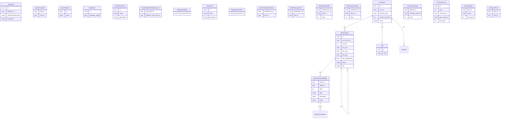

# Pathfinder 1e Web Character
This Project shall provide a multilingual Pathfinder (at least german) web site. It will be designed to server the players as an easy to handle tool for
- character creation
- character leveling
- playing

The whole system will be designed in a way, only currently relevant elements are added. If this are classes, feats or spells.

**The System is designed to run only local**
# Architecture
The system posesses of serveral parts:
- Web UI for Player interaction
- Backend service to serve the frontend and store the data
- Database

Backend and Database are created as docker images for easy migration between systems.

As this is created as local only system, without any valid data, beside of the username, there is no security done by intention.
# Database
The Database is heart of the backend. For this it is composed of tree main parts:
- Definitions (Classes, Feats, etc.)
- Character data (Name, Stats, etc.)
- descriptions

## Explaination
One, and only one to zero or many: ||--o{
One to zero or |o--o{

