# Pathfinder 1e Web Character
This Project shall provide a multilingual Pathfinder (at least german) web site. It will be designed to server the players as an easy to handle tool for
- character creation
- character leveling
- playing

The whole system will be designed in a way, only currently relevant elements are added. If this are classes, feats or spells.

**The System is designed to run only local**
# Architecture
The system posesses of serveral parts:
- Web UI for Player interaction
- Backend service to serve the frontend and store the data
- Database

Backend and Database are created as docker images for easy migration between systems.

As this is created as local only system, without any valid data, beside of the username, there is no security done by intention.
## Web UI
The Web UI is the interface to the user. It shows the character sheet, and the options. Available.
For this there are some different Screens:
### Main Screen
The Main screen is split into 3 Parts. On the left half of the screen, there is the players sheet. On the right top corner, there is the current available actions, such as use a daily power. In the lower right corner there are modifications available such as Conditions and Spells. 
### Level Up Screen
In this sepearte Screen, the single elements of the character become editable. When leveling up, at first a class must be selected, than any further decisions need to be taken, after confirmation, this could not be undone. 
### Inventory screen
While the base inventory is part of the players main sheet, adding new Items is done here. There could be regular predefined items, or custom items, which option to be found, self crafted or bought.
### Item Screen
When adding a new (magic) Item it need to be defined, if it is not one of the predefined ones. For this weapons and amor need to be customized with features.
## Backend
The backend interacts with the storage systems and provides objects rather than table data to the frontend. Further more it provides the information what actions / options are legal at the current state of character.
The backend is the central rules engine and application core of the system. It owns the character state and progression logic, and it provides structured domain objects to the frontend instead of exposing raw database rows. It also evaluates which actions and options are legally available for a character based on their current state, including class features, prerequisites, equipment, effects, and other game rules.

Because Pathfinder contains many special rules, the backend must be designed as an extensible rules system. Classes, feats, spells, abilities, effects, and prerequisites should be added as reusable rule elements rather than being fully hard-coded from the beginning. This allows the system to grow step by step, starting with the core character workflow and later adding more detailed rules and content.

This approach keeps the implementation maintainable: the first version can focus on character creation, leveling, and basic sheet data, while later iterations add more specific rules and features without requiring a redesign of the whole backend.
# Database
The Database is heart of the backend. For this it is composed of tree main parts:
- Definitions (Classes, Feats, etc.)
- Character data (Name, Stats, etc.)
- descriptions

## Explaination
One, and only one to zero or many: ||--o{
One to zero or |o--o{

```mermaid
erDiagram
    BaseClasses ||--o{ BaseClassLevelAbility: has
    BaseClasses {
        uuid id
        uuid arch_class_of
        int hit_dice
        bool wil_save
        bool fort_save
        bool ref_save
        float bab_progression
        string name
        string role
    }
    BaseClasses |o--o{ BaseClasses:has
    BaseClassLevelAbility ||--o{ BaseClassAbilites : provies
    BaseClassLevelAbility {
        uuid class_id
        uuid ability_id
        int level
        string type
        string description
        string name
    }
    BaseSkill {
        uuid id
        uuid attribute_id
        string nameCharacterLevel
        string description
    }
    BaseClassSkill  {
        uuid skill_id
        uuid class_id
    }
    BaseAttribute   {
        uuid id
        string name
    }
    BaseRace {
        uuid id
        data multiplyer_weight
    }
    BaseRacialFeat    {
        uuid id
        string name
        string description
    }
    BaseRacialFeatReplacement    {
        uuid racial_feat_id
        uuid replaces_racial_feat_id
    }
    BaseRaceAbility    {
        race_id
        racial_feat_id
    }
    BaseFeat {
        uuid id 
        string name
        string description
    }
    BaseRequirements {
        uuid requirement_id
    }
    BaseFeatRequirements{
        uuid requirement_id
        uuid feat_id
    }
    BaseRequiredFeat{
        uuid requirement_id
        uuid feat_id
    }
    BaseRequiredSkill{
        uuid requirement_id
        uuid skill_id
        int value
    }
    BaseRequiredClass{
        uuid requirement_id
        uuid class_id
        int value
    }
    User {
        uuid id
        string name
    }
    Character {
        uuid id
        uuid user_id
        uuid prefered_class
        int current_hit_points
        string name
    }
    Character ||--o{ BaseClasses : has
    Character ||--o{ User:has
    CharacterAttribute {
        uuid attribute_id
        uuid character_level_id
        int value
    }
    Character ||--o{ Attribute :has
    CharacterLevel{
        uuid id
        int level
        uuid character_id
        uuid base_class_id
        int hit_points
    }
    CharacterSkill{
        uuid level_id
        uuid skill_id
        int skill_points
    }
    CharacterFeat{
        uuid level_id
        uuid feat_id
    }
    CharacterItems{
        uuid id
        string name
        uuid character_id
        string type
    }
    BaseItemAbility{
        uuid id
        string name
    }
    CharacteritemAbility{
        uuid character_item_id
        uuid character_item_ability_id
    }

```

# Technologies
There are several technologies used throuout such a complex system. For this we will use:
- React for the frontend
- FastAPI as backend server
- PostgresSQL with Vector extension for the backend
- Docker / Podman as server container