# Pathfinder 1e Web Character
This Project shall provide a multilingual Pathfinder (at least german) web site. It will be designed to server the players as an easy to handle tool for
- character creation
- character leveling
- playing

The whole system will be designed in a way, only currently relevant elements are added. If this are classes, feats or spells.

**The System is designed to run only local**
# Architecture
The system posesses of serveral parts:
- Web UI for Player interaction
- Backend service to serve the frontend and store the data
- Database

Backend and Database are created as docker images for easy migration between systems.

As this is created as local only system, without any valid data, beside of the username, there is no security done by intention.
## Web UI
The Web UI is the interface to the user. It shows the character sheet, and the options. Available.
For this there are some different Screens:
### Main Screen
The Main screen is split into 3 Parts. On the left half of the screen, there is the players sheet. On the right top corner, there is the current available actions, such as use a daily power. In the lower right corner there are modifications available such as Conditions and Spells. 
### Level Up Screen
In this sepearte Screen, the single elements of the character become editable. When leveling up, at first a class must be selected, than any further decisions need to be taken, after confirmation, this could not be undone. 
### Inventory screen
While the base inventory is part of the players main sheet, adding new Items is done here. There could be regular predefined items, or custom items, which option to be found, self crafted or bought.
### Item Screen
When adding a new (magic) Item it need to be defined, if it is not one of the predefined ones. For this weapons and amor need to be customized with features.
## Backend
The backend interacts with the storage systems and provides objects rather than table data to the frontend. Further more it provides the information what actions / options are legal at the current state of character.
The backend is the central rules engine and application core of the system. It owns the character state and progression logic, and it provides structured domain objects to the frontend instead of exposing raw database rows. It also evaluates which actions and options are legally available for a character based on their current state, including class features, prerequisites, equipment, effects, and other game rules.

Because Pathfinder contains many special rules, the backend must be designed as an extensible rules system. Classes, feats, spells, abilities, effects, and prerequisites should be added as reusable rule elements rather than being fully hard-coded from the beginning. This allows the system to grow step by step, starting with the core character workflow and later adding more detailed rules and content.

Concretely: which rule elements apply to a character (race, class features, feats, effects, ...) is tracked as data — catalog tables plus grant/replacement relations, e.g. `BaseRaceAbility`/`RaceAbilityGrant`/`RaceAbilityReplacement` for races. Computing what each one actually does is not modeled as further data columns, even for bonuses that look flat (Pathfinder has too many superficially-simple bonuses that turn out to be conditional, e.g. Skill Focus granting +3 normally but +6 at 10+ ranks). Instead, each rule element's effect is resolved by a small handler function, looked up by the element's own UUID (see `CLAUDE.md`). This keeps "what exists and what's granted to what" in data while "how it's computed" stays in code, without needing a schema migration every time a new kind of exception shows up.

This approach keeps the implementation maintainable: the first version can focus on character creation, leveling, and basic sheet data, while later iterations add more specific rules and features without requiring a redesign of the whole backend.
# Database
The Database is heart of the backend. For this it is composed of tree main parts:
- Definitions (Classes, Feats, etc.)
- Character data (Name, Stats, etc.)
- descriptions


## Explaination
One, and only one to zero or many: ||--o{
One to zero or |o--o{

```mermaid
erDiagram
    BaseClasses ||--o{ BaseClassLevelAbility: has
    BaseClasses {
        uuid id
        uuid arch_class_of
        int hit_dice
        bool wil_save
        bool fort_save
        bool ref_save
        float bab_progression
        string name
        string role
    }
    BaseClasses |o--o{ BaseClasses:has
    BaseClassLevelAbility ||--o{ BaseClassAbilites : provies
    BaseClassLevelAbility {
        uuid class_id
        uuid ability_id
        int level
        string type
        string description
        string name
    }
    BaseSkill {
        uuid id
        uuid attribute_id
        string nameCharacterLevel
        string description
    }
    BaseClassSkill  {
        uuid skill_id
        uuid class_id
    }
    BaseAttribute   {
        uuid id
        string name
    }
    BaseRace {
        uuid id
        string code
        string name
        string short_description
    }
    BaseRaceAbility {
        uuid id
        string name
        string description
    }
    RaceAbilityGrant {
        uuid id
        uuid race_id
        uuid ability_id
        bool is_alternate
    }
    RaceAbilityReplacement {
        uuid id
        uuid base_race_id
        uuid ability_id
        uuid replaces_ability_id
    }
    BaseRace ||--o{ RaceAbilityGrant : grants
    BaseRaceAbility ||--o{ RaceAbilityGrant : "granted via"
    BaseRace ||--o{ RaceAbilityReplacement : "defines swaps for"
    BaseRaceAbility ||--o{ RaceAbilityReplacement : "as alternate"
    BaseRaceAbility ||--o{ RaceAbilityReplacement : "as replaced"
    BaseFeat {
        uuid id 
        string name
        string description
    }
    BaseRequirements {
        uuid requirement_id
    }
    BaseFeatRequirements{
        uuid requirement_id
        uuid feat_id
    }
    BaseRequiredFeat{
        uuid requirement_id
        uuid feat_id
    }
    BaseRequiredSkill{
        uuid requirement_id
        uuid skill_id
        int value
    }
    BaseRequiredClass{
        uuid requirement_id
        uuid class_id
        int value
    }
    User {
        uuid id
        string name
    }
    Character {
        uuid id
        uuid user_id
        uuid race_id
        uuid prefered_class
        int current_hit_points
        string name
    }
    Character ||--o{ BaseClasses : has
    Character ||--o{ BaseRace : has
    Character ||--o{ User:has
    CharacterAttribute {
        uuid attribute_id
        uuid character_level_id
        int value
    }
    Character ||--o{ Attribute :has
    CharacterLevel{
        uuid id
        int level
        uuid character_id
        uuid base_class_id
        int hit_points
    }
    CharacterSkill{
        uuid level_id
        uuid skill_id
        int skill_points
    }
    CharacterFeat{
        uuid level_id
        uuid feat_id
    }
    CharacterItems{
        uuid id
        string name
        uuid character_id
        string type
    }
    BaseItemAbility{
        uuid id
        string name
    }
    CharacteritemAbility{
        uuid character_item_id
        uuid character_item_ability_id
    }

```



# Technologies
There are several technologies used throuout such a complex system. For this we will use:
- React for the frontend
- FastAPI as backend server
- PostgresSQL with Vector extension for the backend
- Docker / Podman as server container

# Running locally (current scaffold stage)
The `frontend/` and `backend/` directories hold the current React + FastAPI scaffold (character sheet, character-creation wizard, level-up wizard — all served from static JSON fixtures, no database yet).

Both together, via the root `dev.sh` script (starts backend + frontend, Ctrl+C stops both):
```bash
./dev.sh
```
It uses the project venv at `~/python/pathfinder_web` by default (override with `PATHFINDER_VENV`); run `pip install -r backend/requirements.txt` there first if you haven't. `npm install` in `frontend/` is still needed once, or after `package.json` changes.

Or start them separately:

**Backend** (FastAPI, port 8000):
```bash
cd backend
source ~/python/pathfinder_web/bin/activate   # project venv, see CLAUDE.md
pip install -r requirements.txt               # first time / after requirements.txt changes
uvicorn app.main:app --reload --port 8000
```

**Frontend** (React + Vite, port 5173):
```bash
cd frontend
npm install    # first time / after package.json changes
npm run dev
```

Then open `http://localhost:5173/` in a browser — that's the only port you need to visit. Vite proxies `/api/*` requests to the backend on `http://localhost:8000` (see `frontend/vite.config.ts`; overridable via a `VITE_API_URL` env var if you want the frontend to hit a different backend origin directly). Available routes: `/` (character sheet), `/create` (character creation), `/levelup/:characterId` (level-up).

# API Endpoints

All entity ids in path parameters (`character_id`, `user_id`, `item_id`, `effect_id`, `spell_id`, `slot_id`, etc.) are UUIDs, consistent with the `uuid id` fields in the ER diagram above. Tracked with implementation status in `todos.md`.

## Reference data

Mostly static-fixture GETs (`backend/app/main.py`, backed by JSON files in `backend/app/fixtures/`, not a database) — except races (real database tables as of roadmap slice 2, `backend/app/routers/races.py`/`backend/app/models/race.py`) and class *identity* (a minimal `BaseClass` table as of roadmap slice 3, `backend/app/models/base_class.py` — id/name only, a FK target for `CharacterLevel.base_class_id`; class rules content stays in `classes.json`, joined by name):

| Method | Path | Backed by |
|---|---|---|
| GET | `/api/races` | database (`BaseRace`/`BaseRaceAbility`/`RaceAbilityGrant`/`RaceAbilityReplacement`) |
| GET | `/api/classes` | fixture (identity mirrored in `BaseClass`, not exposed via this endpoint) |
| GET | `/api/feats` | fixture |
| GET | `/api/traits` | fixture |
| GET | `/api/skills` | fixture |
| GET | `/api/abilities` | fixture |
| GET | `/api/spells-by-class` | fixture |
| GET | `/api/point-buy-costs` | fixture |
| GET | `/api/items` | fixture |
| GET | `/api/effects` | fixture |
| GET | `/api/class-level-options` | fixture |
| GET | `/api/characters/{character_id}` | fixture for the two mock characters, database for real (slice 2) characters |
| GET | `/api/characters/{character_id}/progression` | fixture |

## User management (implemented — database-backed)

The first slice with a real table + write endpoints (`backend/app/models/user.py`,
`backend/app/routers/users.py`); `AppHeader`'s user picker and "+ Neuer Nutzer"
form call these instead of local state:

| Method | Path | Purpose |
|---|---|---|
| POST | `/api/users` | create a user |
| GET | `/api/users` | list users, for the user picker |
| GET | `/api/users/{user_id}/characters` | list a user's characters, for the header's character picker |
| PATCH | `/api/users/{user_id}` | rename a user (no frontend UI wired to this yet) |

## Character management (implemented — database-backed, roadmap slice 2)

`backend/app/models/character.py`, `backend/app/routers/characters.py`. Character row (name, user,
race, ability scores, nullable current_hit_points) plus per-level history: `CharacterLevel` (one row
per character level — `character_id`, `level`, `base_class_id`, nullable `hit_points`) rather than a
`class_name`/`level` pair on `characters`, so multiclassing needs no later schema change (roadmap
slice 3's class-selection item). `Character.level`/`Character.classes` are computed properties, not
stored columns. `POST /api/characters` takes `classes: [{class_name, level}, ...]`. Skills/feats/
traits/computed AC are still a later "thick" pass. The creation wizard's `SummaryStep` calls
`POST /api/characters` for real instead of showing a mock confirmation banner; the created character
now appears in the header's character picker (`GET /api/users/{user_id}/characters`,
`frontend/src/state/AppStateContext.tsx`'s `dbCharacterIds`), but selecting it on the main character
sheet shows a placeholder rather than a full sheet — the thin/computed shape has none of the
rich fixture fields (`abilities`, `gear`, `spellsKnown`, ...) yet (needs the thick pass).

| Method | Path | Purpose |
|---|---|---|
| POST | `/api/characters` | finalize the character-creation wizard |
| GET | `/api/characters/{character_id}` | fetch a character (merged into the existing mock-fixture endpoint) |
| PATCH | `/api/characters/{character_id}` | rename a character |
| DELETE | `/api/characters/{character_id}` | delete a character |

## Not yet implemented

The frontend (`frontend/src/api/client.ts`) has `apiGet`/`apiPost`/`apiPatch`/`apiDelete`,
but only the user-management and character-management endpoints above are wired up so far —
every other user interaction below that changes data is presently local React state only
and is lost on reload.

**Character management**
| Method | Path | Purpose |
|---|---|---|
| PUT | `/api/characters/{character_id}/draft` | (optional) autosave the creation wizard mid-flight |

**Level-up**
| Method | Path | Purpose |
|---|---|---|
| POST | `/api/characters/{character_id}/level-up` | finalize the level-up wizard: applies class/HP/feat/skill/spell changes |
| GET | `/api/characters/{character_id}/history` | level-up/change history (`requirements_v2.md` §2 requires this; no supporting data model exists yet) |

**Vitals/combat**
| Method | Path | Purpose |
|---|---|---|
| PATCH | `/api/characters/{character_id}/hp` | apply damage/heal to current HP |

AC, initiative, etc. should be backend-computed from equipped items + ability modifiers rather than written directly; today AC is static fixture data with no recompute logic anywhere.

**Effects, conditions, time**
| Method | Path | Purpose |
|---|---|---|
| POST | `/api/characters/{character_id}/effects/{effect_id}/activate` | activate a catalog condition/effect on the character |
| DELETE | `/api/characters/{character_id}/effects/{active_effect_id}` | manually remove/dispel an active effect early |
| POST | `/api/characters/{character_id}/effects/custom` | add a free-form effect with a manually chosen duration |
| POST | `/api/characters/{character_id}/advance-time` | advance time by round/minute/hour, counting down active effect durations |
| POST | `/api/characters/{character_id}/rest` | day change / rest — reset spells and effects (kept separate from `advance-time` so a short rest and a full day change can eventually diverge) |

**Spells**
| Method | Path | Purpose |
|---|---|---|
| POST | `/api/characters/{character_id}/spells/{spell_id}/cast` | mark a known/prepared spell as used for the day |
| POST | `/api/characters/{character_id}/spells/{spell_id}/prepare` | prepare a spell (server enforces `maxPrepared` per grade) |
| DELETE | `/api/characters/{character_id}/spells/{spell_id}/prepare` | unprepare a spell |
| POST | `/api/characters/{character_id}/spellbook` | add a spell to the spellbook/known list during play (`requirements_v2.md` §2.2: managed like inventory, not just at creation/level-up) |
| DELETE | `/api/characters/{character_id}/spellbook/{spell_id}` | remove a spell from the spellbook/known list |

**Equipment/inventory**
| Method | Path | Purpose |
|---|---|---|
| POST | `/api/characters/{character_id}/gear` | add an inventory item |
| PATCH | `/api/characters/{character_id}/gear/{item_id}` | rename/change quantity, set enhancement bonus, toggle special properties |
| DELETE | `/api/characters/{character_id}/gear/{item_id}` | remove an inventory item |
| PUT | `/api/characters/{character_id}/slots/{slot_id}` | equip/unequip an item into an equipment slot (should validate the item is in inventory and trigger AC recompute) |

**Background/notes**
| Method | Path | Purpose |
|---|---|---|
| GET | `/api/characters/{character_id}/background` | backstory, goals/motivations, NPC relationships |
| PUT | `/api/characters/{character_id}/background` | save backstory/goals/relationships (`requirements_v2.md` §2.4 — no frontend UI exists for this yet either) |

**Rules/reference**
| Method | Path | Purpose |
|---|---|---|
| GET | `/api/compendium/search?q=` | full-text rule lookup across feats/spells/class features; today's in-sheet search only indexes the loaded character's own data, not a rules database |